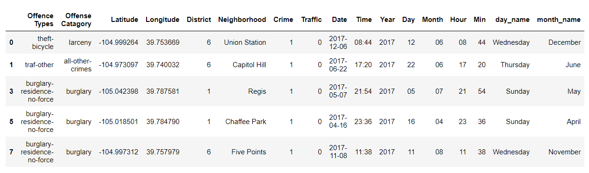

<!-- TABLE OF CONTENTS -->

  
Table of Contents

  <ol>
    <li>
      <a href="#about-the-project">Description of the Problem and Discussion of the Background</a>
      <ul>
        <li><a href="#introduction">Introduction Section:</a></li>
        <li><a href="#Target">Target Audience:</a></li>
        <li><a href="#Data">Data Description and Data Sources:</a></li>
      </ul>
    </li>
    <li>
      <a href="#Loading">Loading crime data of Denver City, CO</a>
      <ul>
        <li><a href="#prerequisites">Data observation and some further process for our goal.</a></li>
      </ul>
    </li>
    <li><a href="#usage">Visualization</a>
       <ul>
        <li><a href="#Crime">Number of crimes per Crime Code Description.</a></li>
         <li><a href="#Month">Number of crimes per Month.</a></li>
         <li><a href="#Day">Number of crimes per Day of the Month.</a></li>
         <li><a href="#Area">Number of crimes per Area.</a></li>
      </ul>
    </li>
    <li><a href="#Foursquare">Foursquare Venue Data</a></li>
    <li><a href="#Modeling">Data Modeling</a></li>
    <li><a href="#Random">Random Forest Algorithm</a></li>
    <li><a href="#acknowledgements">Acknowledgements</a></li>
  </ol>

<!-- ABOUT THE PROJECT -->
## Description of the Problem and Discussion of the Background

<!-- introduction -->
### Introduction Section:

The police of Denver, Colorado patrolling in the whole city. However, various crimes occurred in any part of the city. Due to the limited number of patrolling cars of the police department, most of the area is not covered by the police cars. Therefore, police need to know those areas, where most crimes have occurred. So that, they can cover most of the area by sending police car. The less crime area can be omitted.

To understand these, the police needs answers to several questions. The answers to those questions must be supported by data and analytics. These are their questions:

1) How can we find those areas, where the most crimes have occurred?
2) How can we find the most offensive crimes and the area?
3) How can we find the most most occured crime?

### Target Audience

The analysis would help any the police department of the city of Denver to predict the place of the crimes and types of the crimes. Moreover, the police can increase/decrease the number of patrolling cars in an area, where it's needed. The crime data frame was modeled using a Random Forest algorithm. The classification of crimes was based on location, time and date.

### Data Description and Data Sources
Data used in this project is collected from several sources. A brief description of the sources of data are given below:

This dataset includes criminal offenses in the City and County of Denver for the previous five calendar years plus the current year to date. The data is based on the National Incident Based Reporting System (NIBRS) which includes all victims of person crimes and all crimes within an incident. The data is dynamic, which allows for additions, deletions and/or modifications at any time, resulting in more accurate information in the database. Due to continuous data entry, the number of records in subsequent extractions are subject to change. Crime data is updated Monday through Friday. The following image shows an some data from the crimes data:

For more info please check the following link:

https://www.denvergov.org/opendata/dataset/city-and-county-of-denver-crime

Foursquare API to explore venue types surrounding each neighborhood of the city of Denver. The query was made for the number of venues in each category within a 1000m radius around each neighborhood (“Documentation — Foursquare Developer”, 2020).

<!-- GETTING STARTED -->
## Loading crime data of Denver City, CO

To speed up processing, the data was stored locally on the machine after it was formatted as desired. To keep computing costs relatively low, only the crimes from 2017 were chosen.

## Data observation and some further process for our goal.

## Visualization

We can now visualize the crimes that were committed in 2017 based on various parameters such as number of crimes per:

1. Type of crime
2. Per month
3. Per day of the month
4. Per time of day
5. Per Neighborhood

### Number of crimes per Crime Code Description¶

The top 25 crimes from 2017 were plotted on a bar chart. It was not very surprising to see there were a lot of theft ittem from vehicle related crimes. The large number of Identity Theft cases was a surprise than other crime.

<!-- ROADMAP -->
## Roadmap

See the [open issues](https://github.com/othneildrew/Best-README-Template/issues) for a list of proposed features (and known issues).

<!-- CONTRIBUTING -->
## Contributing

Contributions are what make the open source community such an amazing place to be learn, inspire, and create. Any contributions you make are **greatly appreciated**.

1. Fork the Project
2. Create your Feature Branch (`git checkout -b feature/AmazingFeature`)
3. Commit your Changes (`git commit -m 'Add some AmazingFeature'`)
4. Push to the Branch (`git push origin feature/AmazingFeature`)
5. Open a Pull Request

<!-- LICENSE -->
## License

Distributed under the MIT License. See `LICENSE` for more information.

<!-- CONTACT -->
## Contact

Your Name - [@your_twitter](https://twitter.com/your_username) - email@example.com

Project Link: [https://github.com/your_username/repo_name](https://github.com/your_username/repo_name)

<!-- ACKNOWLEDGEMENTS -->
## Acknowledgements
* [GitHub Emoji Cheat Sheet](https://www.webpagefx.com/tools/emoji-cheat-sheet)
* [Img Shields](https://shields.io)
* [Choose an Open Source License](https://choosealicense.com)
* [GitHub Pages](https://pages.github.com)
* [Animate.css](https://daneden.github.io/animate.css)
* [Loaders.css](https://connoratherton.com/loaders)
* [Slick Carousel](https://kenwheeler.github.io/slick)
* [Smooth Scroll](https://github.com/cferdinandi/smooth-scroll)
* [Sticky Kit](http://leafo.net/sticky-kit)
* [JVectorMap](http://jvectormap.com)
* [Font Awesome](https://fontawesome.com)

