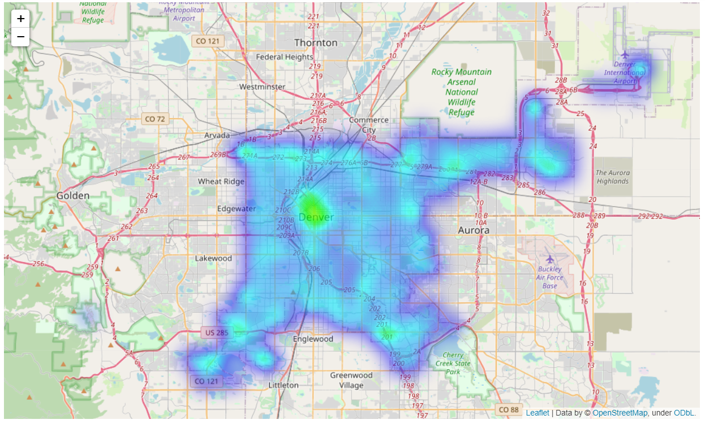

<!-- TABLE OF CONTENTS -->

  
Table of Contents

  <ol>
    <li>
      <a href="#about-the-project">Description of the Problem and Discussion of the Background</a>
      <ul>
        <li><a href="#introduction">Introduction Section:</a></li>
        <li><a href="#Target">Target Audience:</a></li>
        <li><a href="#Data">Data Description and Data Sources:</a></li>
      </ul>
    </li>
    <li>
      <a href="#Loading">Loading crime data of Denver City, CO</a>
      <ul>
        <li><a href="#prerequisites">Data observation and some further process for our goal.</a></li>
      </ul>
    </li>
    <li><a href="#usage">Visualization</a>
       <ul>
        <li><a href="#Crime">Number of crimes per Crime Code Description.</a></li>
         <li><a href="#Month">Number of crimes per Month.</a></li>
         <li><a href="#Day">Number of crimes per Day of the Month.</a></li>
         <li><a href="#Area">Number of crimes per Area.</a></li>
      </ul>
    </li>
    <li><a href="#Foursquare">Foursquare Venue Data</a></li>
    <li><a href="#Modeling">Data Modeling</a></li>
    <li><a href="#Random">Random Forest Algorithm</a></li>
    <li><a href="#acknowledgements">Acknowledgements</a></li>
  </ol>

<!-- ABOUT THE PROJECT -->
## Description of the Problem and Discussion of the Background

<!-- introduction -->
### Introduction Section:

The police of Denver, Colorado patrolling in the whole city. However, various crimes occurred in any part of the city. Due to the limited number of patrolling cars of the police department, most of the area is not covered by the police cars. Therefore, police need to know those areas, where most crimes have occurred. So that, they can cover most of the area by sending police car. The less crime area can be omitted.

To understand these, the police needs answers to several questions. The answers to those questions must be supported by data and analytics. These are their questions:

1) How can we find those areas, where the most crimes have occurred?
2) How can we find the most offensive crimes and the area?
3) How can we find the most most occured crime?

### Target Audience

The analysis would help any the police department of the city of Denver to predict the place of the crimes and types of the crimes. Moreover, the police can increase/decrease the number of patrolling cars in an area, where it's needed. The crime data frame was modeled using a Random Forest algorithm. The classification of crimes was based on location, time and date.

### Data Description and Data Sources
Data used in this project is collected from several sources. A brief description of the sources of data are given below:

This dataset includes criminal offenses in the City and County of Denver for the previous five calendar years plus the current year to date. The data is based on the National Incident Based Reporting System (NIBRS) which includes all victims of person crimes and all crimes within an incident. The data is dynamic, which allows for additions, deletions and/or modifications at any time, resulting in more accurate information in the database. Due to continuous data entry, the number of records in subsequent extractions are subject to change. Crime data is updated Monday through Friday. The following image shows an some data from the crimes data:

For more info please check the following link:

https://www.denvergov.org/opendata/dataset/city-and-county-of-denver-crime

Foursquare API to explore venue types surrounding each neighborhood of the city of Denver. The query was made for the number of venues in each category within a 1000m radius around each neighborhood (“Documentation — Foursquare Developer”, 2020).

<!-- GETTING STARTED -->
## Loading crime data of Denver City, CO

To speed up processing, the data was stored locally on the machine after it was formatted as desired. To keep computing costs relatively low, only the crimes from 2017 were chosen.

## Data observation and some further process for our goal.

## Visualization

We can now visualize the crimes that were committed in 2017 based on various parameters such as number of crimes per:

1. Type of crime
2. Per month
3. Per day of the month
4. Per time of day
5. Per Neighborhood

### Number of crimes per Crime Code Description

The top 25 crimes from 2017 were plotted on a bar chart. It was not very surprising to see there were a lot of theft ittem from vehicle related crimes. The large number of Identity Theft cases was a surprise than other crime.

### Number of crimes per Month Code Description

The crimes from 2017 were plotted on a bar chart as number of crimes per month. The number of crimes stayed consistent with a dip in October, November, and December, which can be attributed to a lower number of days in the month and an increase in the other months.

### Number of crimes per Day of the Month Code Description

The crimes from 2017 were plotted on a bar chart as number of crimes per day of the month. The number of crimes stayed consistent throughout the month typically. The drop in number of crimes on the 31st is because not every month has 31 days. Similarly with reduced contributions from February (29th and 30th). It could potentially be an issue and the data would likely need a weighted average of some kind to scale it uniformly.

### Number of crimes per Area Code Description
The crimes from 2017 were plotted on a bar chart as number of crimes per neighborhood of occurrence. It is clear which areas are the most dangerous -Five Points is the worst neighborhoods in the city. Wellshire and Indian Creek are the best neighborhoods in the city.

The crimes by count were selected from the 2017 crime dataframe. These were assigned a blue color and the result was charted using folium. The next section show the crime distributions in the city using cluster maps and heat maps.

## Foursquare Venue Data
The next step was to use the Foursquare API to retrieve data for businesses and services around a particular neighborhood. Using the Venue ID, a subsequent call was designed to extract the venue rating. However, this is a Premium endpoint and was limited to only 500 requests per day which was not sufficient to handle our dataset of approximately 50,000 venues. While the code is shown below, we subsequently discard the venue_rating column from our dataset. The dataframe was stored locally on the machine for faster retrieval.

## Data Modeling
The 2017 crime data frame was modeled using a Random Forest algorithm. The classification of crimes was based on location, time and date.

The first step was to classify dangerous crimes such as assault and theft related crimes and assign them a value 1. All other crimes were classified with a 0.

The next step was applying One-Hot Encoding on the hour of day, day of month, month, latitude and longitude where the crime occurred.

## Random Forest Algorithm
The RF algorithm was chosen to model and classify the dataset. This algorithm searches for the best feature among a random subset of features while splitting a node. Another important advantage of this algorithm is the ability to visualize the relative importance of different features.

The dataset was split into train and test datasets.

<!-- LICENSE -->
## License

Distributed under the Open source License.

